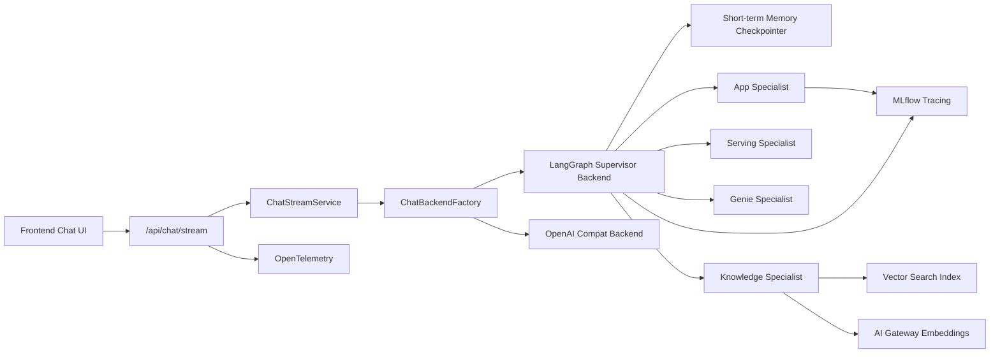

# databricks-apps-fastapi-starter

[](https://snyk.io/test/github/Paldom/databricks-apps-fastapi-starter)
[](https://sonarcloud.io/summary/new_code?id=Paldom_databricks-apps-fastapi-starter)


[](https://docs.databricks.com/en/dev-tools/databricks-apps/)
[](LICENSE)

A production-ready FastAPI template for building data and AI applications on **Databricks Apps**, featuring built-in authentication, database connectivity, and deployment automation. It demonstrates how a FastAPI backend can call various Databricks capabilities including Jobs, Serving endpoints, Delta tables & Volumes, Genie & AgentBricks Knowledge Assistant, AI Gateway, Vector Search and Lakebase.

## Quickstart

### Local development (no Databricks workspace needed)

```bash
git clone https://github.com/Paldom/databricks-apps-fastapi-starter.git
cd databricks-apps-fastapi-starter

cp backend/env.example backend/.env   # defaults work out of the box
make install-backend                   # install Python deps via uv
make dev-db                            # start Postgres in Docker
make migrate-up                        # run database migrations
make dev                               # start API + frontend
```

Open `http://localhost:8000/docs`. Auth is handled by a fallback dev user -- no credentials needed.

Databricks integrations are disabled by default. To test against a real workspace, set `ENABLE_DATABRICKS_INTEGRATIONS=true` and your Databricks credentials in `backend/.env`.

### Deploy to Databricks

> **Requires:** [Databricks CLI](https://docs.databricks.com/en/dev-tools/cli/install.html) >= 0.283.0 and a workspace with **Databricks Apps** and **Lakebase** previews enabled.

#### Step 1 -- Authenticate the CLI

```bash
databricks configure    # enter your workspace URL and authenticate
```

#### Step 2 -- Deploy the bundle

```bash
databricks bundle validate -t dev
databricks bundle deploy -t dev
```

This creates the app, Lakebase database, serving endpoint, job, vector search index, and secret scope. Everything under `resources/*.yml` is provisioned automatically.

#### Step 3 -- Manual steps (not handled by the bundle)

These operations require manual action because they involve workspace UI toggles that DAB cannot automate:

| Step | Why it's manual | Command / action |
|------|----------------|-----------------|
| **Enable Lakebase preview** | Workspace admin toggle, one-time | Workspace UI > Previews > enable **Lakebase (OLTP)** |
| **Enable Apps user auth preview** | Workspace admin toggle, one-time | Workspace UI > Previews > enable **User authorization for Databricks Apps** |
| **Create a UC Volume** | Must exist before the app resource binding can reference it | Create `main.default.starter_volume` in Unity Catalog (or override `volume_full_name` in `databricks.yml`) |

#### Step 4 -- Start the app

```bash
databricks bundle run -t dev fastapi_app
```

Verify with `GET /api/health/live` and `GET /api/health/ready` from the app URL shown in the Databricks Apps UI.

#### Optional specialist resources

If you want to use the LangGraph supervisor with specialist tools, these additional resources must exist in your workspace. Configure them via bundle variables or `databricks.yml`:

| Resource | Variable | What it enables |
|----------|----------|----------------|
| Serving endpoint for supervisor LLM | `supervisor_model` | LangGraph supervisor routing |
| Serving agent endpoint | `serving_agent_endpoint` | Serving agent tool (Responses API) |
| Genie space | `genie_space_id` | Genie data specialist tool |
| AI Gateway embedding endpoint | `ai_gateway_embedding_model` | Knowledge specialist embeddings |
| Vector Search index + endpoint | `vector_search_index_name`, `vector_search_endpoint_name` | Knowledge specialist retrieval |
| MLflow experiment | set `MLFLOW_EXPERIMENT_ID` env var | GenAI tracing |

These are all optional. The app starts and serves chat with just the base deployment.

#### Deploying the serving agent

The repo includes a built-in serving agent under `notebooks/serving/`. It is a minimal `ResponsesAgent` that forwards to an upstream AI Gateway model. To deploy it:

**1. Create the `serving-agent` secret scope** with service principal credentials that the endpoint runtime will use:

```bash
# Create the scope (one-time)
databricks secrets create-scope serving-agent

# Store a service principal's credentials
databricks secrets put-secret serving-agent databricks-client-id --string-value "<SP_CLIENT_ID>"
databricks secrets put-secret serving-agent databricks-client-secret --string-value "<SP_CLIENT_SECRET>"
```

The service principal must have permission to call the upstream AI Gateway / Foundation Model endpoint configured in `serving_agent_chat_model`.

**2. Set the required bundle variables** in `databricks.yml` or via CLI overrides:

```yaml
variables:
  serving_agent_endpoint: serving-agent-dev
  serving_agent_uc_model_name: main.default.serving_agent_dev
  serving_agent_chat_model: databricks-claude-sonnet-4  # or your preferred model
```

**3. Deploy:**

```bash
databricks bundle deploy -t dev
databricks bundle run -t dev deploy_serving_agent
databricks bundle run -t dev fastapi_app
```

The deploy job logs the agent model, registers it in Unity Catalog, creates or updates the endpoint with the secret-backed auth, and waits for readiness.

## Bundle-First Deployment

This repository uses **Databricks Asset Bundles** as the single deployment contract. All infrastructure (app, serving endpoint, job, database, vector search, secret scope) is defined in modular YAML files under `resources/` and deployed with `databricks bundle deploy`.

There is no workspace Repo sync, no Git credential registration, and no manual `databricks apps deploy` commands. The committed `databricks.yml` and `resources/*.yml` files are the source of truth.

### What this means

- **Runtime app config** (command, env vars) is defined in the bundle YAML via a complex `app_config` variable, not a standalone `app.yaml`
- **Resource-backed env vars** (`SERVING_ENDPOINT_NAME`, `JOB_ID`, `VOLUME_ROOT`, secrets) are injected via `valueFrom` app resource bindings
- **Three targets** are supported: `dev`, `staging`, `prod`
- **CI/CD** uses `databricks bundle validate/deploy/run` exclusively

## Architecture

[](databricks-apps-architecture.svg)

### Bundle resources

| Resource | File | Purpose |
|----------|------|---------|
| FastAPI App | `resources/app.yml` | App definition with resource bindings and runtime config |
| Serving Endpoint | `resources/serving.yml` | MLflow model serving (starter) |
| Serving Agent Deploy | `resources/serving_agent.yml` | Job + experiment to deploy the serving agent |
| Job + Cluster | `resources/compute.yml` | Spark job for background tasks |
| Lakebase Instance | `resources/database.yml` | PostgreSQL-compatible OLTP database |
| Vector Search Index | `resources/vector_search.yml` | Delta Sync vector index |
| Secret Scope | `resources/secrets.yml` | Reserved for future app secrets |

### App resource bindings

The app is granted access to specific Databricks resources with least-privilege permissions:

| Binding name | Resource type | Permission |
|-------------|---------------|------------|
| `serving-endpoint` | Serving endpoint | `CAN_QUERY` |
| `app-job` | Job | `CAN_MANAGE_RUN` |
| `uc-volume` | UC Volume | `WRITE_VOLUME` |
| `lakebase-db` | Database (Lakebase) | `USE` |
| `knowledge-assistant` | Serving endpoint | `CAN_QUERY` |

These bindings are used with `valueFrom` in the app's env config, so the app receives resolved values as environment variables at runtime.

### Repository layout

```
backend/                 # Self-contained Python project (uv, pyproject.toml)
  app/                   # FastAPI application package
    api/                 # Frontend-facing API routes (mounted at /api)
    chat/                # Chat architecture (backends, orchestrator, title)
      backends/          # ChatBackend Protocol, Factory, implementations
      orchestrator/      # LangGraph supervisor graph, memory, events, tools
      title/             # Chat session title generation
    services/            # Business logic
    repositories/        # SQLAlchemy persistence (flush only)
    agents/              # Deployable agent models (e.g. minimal_serving_agent)
    core/databricks/     # Databricks SDK adapters (serving, jobs, vector search, etc.)
    core/db/             # Async SQLAlchemy engine, session, URL builder
    core/security/       # Path validation
    middlewares/         # Auth, OBO, security headers, request size
    models/              # ORM models and DTOs
  alembic/               # Database migrations
  tests/                 # Backend tests (pytest)
  scripts/               # OpenAPI export, helpers
  notebooks/             # Databricks notebooks (jobs, serving)
  openapi.yaml           # Committed OpenAPI contract (YAML)
frontend/                # React + TypeScript + Vite
resources/               # Databricks bundle resource definitions
databricks.yml           # Bundle config (root level)
Makefile                 # Root orchestration — delegates to backend/Makefile
```

All root-level `make` commands continue to work. The backend can also be used directly: `cd backend && uv run uvicorn app.main:app --reload`.

## Chat Architecture

The `/api/chat/stream` endpoint is backed by a **Protocol/Factory** abstraction that decouples the streaming contract from the underlying chat implementation. A `ChatBackend` Protocol defines the interface; a `ChatBackendFactory` selects the active implementation based on the `CHAT_BACKEND` setting.



### Backends

| Backend | Setting value | Description |
|---------|--------------|-------------|
| **OpenAI Compat** | `openai_compat` | Direct `AsyncOpenAI.chat.completions.create()` streaming. Simplest path, good for local dev. |
| **LangGraph Supervisor** | `langgraph_supervisor` | LangGraph-based supervisor with short-term memory and specialist tools. Default when deployed. |

Set `CHAT_BACKEND` to switch. The factory falls back to `openai_compat` if LangGraph initialization fails.

### LangGraph supervisor

The supervisor is a small `StateGraph` that routes requests to specialist tools:

1. **App Specialist** (always available) -- in-process LLM for clarification, synthesis, formatting, and fallback help.
2. **Serving Agent** (optional) -- queries a ResponsesAgent deployed on Databricks Model Serving via `SERVING_AGENT_ENDPOINT`. Defaults to the Responses API (`SERVING_AGENT_API_MODE=responses`).
3. **Genie Specialist** (optional) -- structured analytics, KPIs, trends, and SQL-like questions via the Databricks Genie Conversation API.
4. **Knowledge Specialist** (optional) -- unstructured document retrieval using AI Gateway embeddings and Vector Search. Returns citations tied to UC Volume paths.

Only specialists with backing resources configured are registered. The supervisor answers trivial requests directly.

### Short-term memory

Server-side conversation memory is keyed by `thread_id` (maps to the chat session ID).

- **First request** for a thread (no checkpoint): the full incoming message history seeds the graph.
- **Subsequent requests** (checkpoint exists): only the latest user message is appended -- prior context is already persisted.

Memory backends:

| Backend | Setting value | Notes |
|---------|--------------|-------|
| In-memory | `inmemory` | Default. Suitable for local dev and single-process deployments. State is lost on restart. |
| Lakebase | `lakebase` | Placeholder for production. Falls back to in-memory until implemented. |

Set `LANGGRAPH_MEMORY_BACKEND` to choose.

### Streaming event contract

All backends emit the same NDJSON event types consumed by the frontend:

- `text-delta` -- streamed assistant text
- `tool-call-begin` -- tool invocation started
- `tool-call-delta` -- tool argument chunks
- `done` -- stream completed
- `error` -- exception during processing

### Title generation

After the first successful stream response, the controller schedules asynchronous, best-effort title generation. Titles are 3-6 words, persisted via `ChatService.update_chat()`, and only generated when the chat has no title yet. Set `ENABLE_CHAT_TITLE_GENERATION=false` to disable.

### Chat specialist resources

| Resource | Required for | Permission |
|----------|-------------|------------|
| Serving Endpoint (supervisor model) | Supervisor LLM and app specialist | `CAN QUERY` |
| Serving Endpoint (serving specialist) | Serving specialist | `CAN QUERY` |
| Genie Space | Genie specialist | `CAN RUN` |
| Vector Search Index | Knowledge specialist | `CAN SELECT` |
| UC Volume | Knowledge specialist citations | `READ VOLUME` |
| AI Gateway endpoint | Knowledge specialist embeddings | `CAN QUERY` |
| Lakebase database | Short-term memory (when using lakebase backend) | Schema/table grants for checkpoints |
| MLflow Experiment | Tracing | Write access |

### Observability

The chat architecture has dual-track observability:

| Signal | System | What it captures |
|--------|--------|-----------------|
| App traces | **OpenTelemetry** | Backend selection, graph execution, memory bootstrap, specialist calls, title generation |
| GenAI traces | **MLflow** | LangGraph execution (via `langchain.autolog()`), OpenAI calls (via `openai.autolog()`), per-request session/user metadata |
| Endpoint usage | **AI Gateway** | Configured on the endpoint side, not in app code. Usage data appears in `system.ai_gateway.usage` system table. |
| Request/response logs | **Inference tables** | A separate endpoint-side feature that logs to Unity Catalog Delta tables. Not controlled by app code. |

MLflow tracing is bootstrapped at startup when `MLFLOW_EXPERIMENT_ID` is set. Per-request trace metadata (`thread_id`, `user_id`, `backend`) is attached via `mlflow.update_current_trace()`.

### Minimal serving agent

A sample deployable agent is provided at `backend/app/agents/minimal_serving_agent/`. It demonstrates the simplest pattern for a Databricks Model Serving specialist: one role, one prompt, one MLflow PyFunc model. See the agent's own `README.md` for deployment instructions.

### Known limitations

- Lakebase-backed checkpointer is a placeholder (falls back to in-memory)
- Genie specialist starts a new conversation per tool call (no cross-turn Genie continuity)
- Downstream trace IDs from specialist responses are not yet captured
- App-to-app specialist invocation is not implemented (architecture supports future addition)

### Agent hosting alternatives

Databricks offers three compute layers for hosting GenAI agents. Each has different strengths, and the right choice depends on your workload:

**Model Serving** -- best for simpler, lower-token, less tool-heavy tasks. It provides a serverless inference endpoint with a clean path for evals, AI Gateway usage tracking, and inference-table monitoring. The trade-off is a synchronous execution model with a 297-second timeout, so agents must finish quickly.

**Lakeflow Jobs** -- best when you need a custom cluster or are running a long-lived pipeline where latency is not critical. Jobs give you strong scheduling, built-in observability, queueing out of the box, and deep integration with the rest of the Databricks platform.

**Databricks Apps** -- best for production-facing agents that need built-in access control, low latency, simple deployment, and horizontal scaling. This is the compute layer used by this starter.

| | Model Serving | Lakeflow Jobs | Databricks Apps |
|---|---|---|---|
| **Best for** | Synchronous inference, evals | Long-lived pipelines, batch | Interactive agents, APIs |
| **Latency** | Low (serverless) | Higher (cluster spin-up) | Low (always-on) |
| **Timeout** | 297 seconds | None (configurable) | None |
| **Scaling** | Auto (serverless) | Per-cluster | Horizontal |
| **Access control** | Endpoint permissions | Job permissions | Built-in user auth |
| **Monitoring** | AI Gateway, inference tables | Job metrics, logs | OTel, MLflow, AI Gateway |
| **Deployment** | MLflow model registration | Bundle / workflow | Bundle / app deploy |

In practice the answer is rarely one or the other. The recommended approach is to combine all three:

- **Databricks Apps** for the main agent orchestrator (this starter's supervisor)
- **Model Serving** for specialist inference endpoints (the serving specialist pattern)
- **Lakeflow Jobs** for background work (data ingestion, index refresh, batch evals)

This starter demonstrates that combination: the FastAPI app runs on Databricks Apps, calls Model Serving endpoints for specialist LLM inference, and can trigger Jobs for background tasks -- all wired through a single Databricks Asset Bundle.

## Prerequisites

- Python 3.11+
- [uv](https://docs.astral.sh/uv/) installed
- [Databricks CLI](https://docs.databricks.com/en/dev-tools/cli/install.html) >= 0.283.0
- [Databricks AI Dev Kit](https://github.com/databricks-solutions/ai-dev-kit) -- provides the Databricks MCP server for AI-assisted development. Install it and configure `.mcp.json` to point to your local `ai-dev-kit` installation (see `.mcp.json` for the `databricks` server entry).
- Access to a Databricks workspace with:
  - **Databricks Apps** enabled
  - **Lakebase (OLTP)** preview enabled (Previews menu)
  - **User authorization for Databricks Apps** preview enabled

## Local Development

The local development workflow is **API on the host + Postgres in Docker**. Databricks integrations are optional and disabled by default for local work.

### Host API + Docker Postgres

```bash
git clone https://github.com/Paldom/databricks-apps-fastapi-starter.git
cd databricks-apps-fastapi-starter

cp backend/env.example backend/.env
make install-backend
make dev-db
make migrate-up
make dev-api
```

With the defaults from `backend/env.example`, the following work locally without Databricks credentials:

- `http://localhost:8000/docs`
- `http://localhost:8000/api/health/live`
- `http://localhost:8000/api/health/ready`
- `http://localhost:8000/health/live`
- `http://localhost:8000/health/ready`
- authenticated `/api` routes via the development fallback user

### Optional remote-integrated local mode

To exercise real Databricks-dependent routes locally, set:

- `ENABLE_DATABRICKS_INTEGRATIONS=true`
- `DATABRICKS_HOST`
- one of:
  - `DATABRICKS_TOKEN`
  - `DATABRICKS_CLIENT_ID` + `DATABRICKS_CLIENT_SECRET`
- any route-specific config such as `SERVING_ENDPOINT_NAME`, `JOB_ID`, `VECTOR_SEARCH_*`, or `KNOWLEDGE_ASSISTANT_ENDPOINT`

You can also use the Databricks local app runner:

```bash
databricks apps run-local --prepare-environment --debug
```

In offline local mode, Databricks example routes return clear `503` responses instead of breaking startup or unrelated endpoints.

### Static analysis

```bash
make lint
make typecheck
make security
```

### Testing

```bash
make test
```

### Performance testing

```bash
make load-test
```

Set `HOST`, `DATABRICKS_HOST`, `DATABRICKS_CLIENT_ID` and `DATABRICKS_CLIENT_SECRET` to target a remote deployment.

### Database migrations

Alembic is the sole schema authority. **Migrations run automatically** on every deploy/restart — `run_app.py` calls `alembic upgrade head` before starting the server. There is no separate migration step for deployed environments.

Alembic reuses the app's engine factory, which includes the OAuth `do_connect` hook for Lakebase authentication. Migrations authenticate the same way the app does.

Database configuration precedence:

1. `DATABASE_URL` (local dev)
2. `PGHOST` / `PGPORT` / `PGDATABASE` / `PGUSER` / `PGPASSWORD` (explicit PG vars)
3. Lakebase OAuth (when deployed — `PGHOST`/`PGDATABASE`/`PGUSER` injected by the database resource binding, password provided by the app's OAuth token)

For local development:

```bash
make migrate-up
```

Create a new migration:

```bash
make migrate-new MIGRATION_MESSAGE="my change"
```

### OpenAPI export

Export the API spec for client codegen:

```bash
make openapi-export
```

## One-Time Bootstrap

### 1. Create a service principal

Create a service principal in your Databricks account for CI/CD:

```bash
databricks service-principals create --display-name "fastapi-starter-deployer"
```

### 2. Configure authentication

**Option A: GitHub OIDC (recommended)**

Follow the [Databricks GitHub OIDC docs](https://docs.databricks.com/aws/en/dev-tools/auth/provider-github) to configure workload identity federation. This avoids storing long-lived secrets.

**Option B: Client secret fallback**

Generate a client secret for the service principal and store it as a GitHub secret.

### 3. Configure local CLI auth

```bash
databricks configure
# Enter your workspace URL and authenticate
```

### 4. Deploy bundle infrastructure

```bash
databricks bundle validate -t dev
databricks bundle deploy -t dev
```

### 5. Start the app

```bash
databricks bundle run -t dev fastapi_app
```

Database migrations run automatically on startup — no separate step is needed.

## GitHub Actions Setup

### Required secrets

| Secret | Description |
|--------|-------------|
| `DATABRICKS_HOST` | Workspace URL (e.g., `https://dbc-123.cloud.databricks.com`) |
| `DATABRICKS_CLIENT_ID` | Service principal client ID |
| `DATABRICKS_CLIENT_SECRET` | Service principal client secret (not needed if using OIDC) |
| `SNYK_TOKEN` | Snyk API token (for security scanning) |
| `SONAR_TOKEN` | SonarCloud token (for code quality) |

### OIDC configuration

The deploy workflow requests `id-token: write` permission for GitHub OIDC. If your workspace is configured for OIDC, `DATABRICKS_CLIENT_SECRET` is not needed.

### CI workflows

| Workflow | Trigger | What it does |
|----------|---------|-------------|
| `ci.yml` | PR, push to main | Ruff, Mypy, Bandit, pytest, frontend build, OpenAPI drift check, bundle validate |
| `deploy.yml` | Push to main, manual | `bundle validate` + `bundle deploy` + `bundle run` |
| `ci-load-test.yml` | PR, manual | Locust performance test (50 users, 60s) |
| `snyk-security.yml` | PR, push, weekly | Dependency and code security scanning |
| `sonar.yml` | PR, push to main | SonarCloud code quality |

## Deploy Commands

### Validate

```bash
databricks bundle validate -t dev
databricks bundle validate -t staging
databricks bundle validate -t prod
```

### Deploy

```bash
databricks bundle deploy -t dev
databricks bundle deploy -t staging
databricks bundle deploy -t prod
```

### Run the app

```bash
databricks bundle run -t dev fastapi_app
databricks bundle run -t prod fastapi_app
```

### View deployed resources

```bash
databricks bundle summary -t dev
```

## Bundle Targets

| Target | Mode | App name | Docs enabled | OBO |
|--------|------|----------|-------------|-----|
| `dev` | development | `databricks-apps-fastapi-starter` | yes | no |
| `staging` | default | `databricks-apps-fastapi-starter-stg` | no | no |
| `prod` | default | `databricks-apps-fastapi-starter-prod` | no | yes |

## Databricks Services

The legacy example router in `backend/app/api/examples_controller.py` exercises several Databricks services:

- **Serving Endpoint** -- queries an MLflow model with seamless scaling
- **Databricks Jobs** -- triggers a job and returns its output
- **AI Gateway** -- gateway for embeddings or foundation model AI queries
- **Vector Search** -- stores and searches embeddings in a vector search index
- **Delta Table** -- reads and persists data in a Unity Catalog Delta table
- **Volume** -- reads and writes files in a Unity Catalog Volume
- **Genie** -- natural language questions about your data using the Conversation API
- **Knowledge Assistant** -- queries an Agent Bricks Knowledge Assistant via the Responses API (both sync and streaming)

## Configuration

The application reads settings from environment variables using Pydantic `Settings` in `backend/app/core/config.py`. When running locally, place variables in `backend/.env`. When deployed via bundles, resource-backed values are injected automatically via `valueFrom`.

Key configuration:

| Variable | Description | Bundle-injected |
|----------|-------------|----------------|
| `ENABLE_DATABRICKS_INTEGRATIONS` | Enables Databricks-only routes and lazy client initialization | Set to `true` in bundle app envs |
| `ENABLE_LOCAL_DEV_AUTH_FALLBACK` | Enables development-only fallback identity when forwarded headers are absent | Set to `false` in bundle app envs |
| `LOCAL_DEV_USER_ID` | Local fallback user id | Manual |
| `DATABASE_URL` | Canonical DB URL override | Manual |
| `PGHOST/PGPORT/PGDATABASE/PGUSER/PGPASSWORD` | Canonical PG-style DB settings | Manual |
| `LAKEBASE_HOST/PORT/DB/USER/PASSWORD` | Backward-compatible DB fallback | Manual |
| `SERVING_ENDPOINT_NAME` | Serving endpoint name | Yes (`valueFrom: serving-endpoint`) |
| `JOB_ID` | Job ID for background tasks | Yes (`valueFrom: app-job`) |
| `VOLUME_ROOT` | UC volume path | Yes (`valueFrom: uc-volume`) |
| `PGHOST/PGDATABASE/PGUSER` | Lakebase connection (injected by `lakebase-db` resource) | Yes (`valueFrom: lakebase-db`) |
| `KNOWLEDGE_ASSISTANT_ENDPOINT` | Knowledge Assistant endpoint name | Yes (`valueFrom: knowledge-assistant`) |
| `ENVIRONMENT` | Runtime environment label | Set in app_config env |
| `LOG_LEVEL` | Python logging level | Set in app_config env |
| `ENABLE_OBO` | On-behalf-of user mode | Set in app_config env |
| `VECTOR_SEARCH_ENDPOINT_NAME` | Vector search endpoint | Yes (via variable) |
| `VECTOR_SEARCH_INDEX_NAME` | Vector search index | Yes (via variable) |
| `CHAT_BACKEND` | Chat backend (`openai_compat` or `langgraph_supervisor`) | Yes (via variable) |
| `LANGGRAPH_MEMORY_BACKEND` | Memory backend (`inmemory` or `lakebase`) | Yes (via variable) |
| `SUPERVISOR_MODEL` | Model for the LangGraph supervisor | Yes (via variable) |
| `APP_SPECIALIST_MODEL` | Model for the app specialist | Yes (via variable) |
| `SERVING_AGENT_ENDPOINT` | Serving agent endpoint | Yes (`valueFrom: serving-agent`) |
| `SERVING_AGENT_API_MODE` | `responses` or `chat_completions` | Yes (via variable) |
| `GENIE_SPACE_ID` | Genie space for data specialist | Yes (via variable) |
| `KNOWLEDGE_VOLUME_ROOT` | UC Volume root for knowledge specialist | Yes (via variable) |
| `AI_GATEWAY_EMBEDDING_MODEL` | Embedding model for knowledge specialist | Yes (via variable) |
| `ENABLE_CHAT_TITLE_GENERATION` | Enable auto title generation | Yes (set to `true`) |
| `MLFLOW_EXPERIMENT_ID` | MLflow experiment for tracing | Manual |

See `backend/env.example` for the full list of configuration variables.

## Security

### Authentication

Databricks Apps authenticates users and forwards identity via HTTP headers:

| Header | Maps to |
|--------|---------|
| `X-Forwarded-User` | `user.id` (primary key) |
| `X-Forwarded-Email` | `user.email` |
| `X-Forwarded-Preferred-Username` | `user.preferred_username` |

For local development you have two options:

- keep `ENABLE_LOCAL_DEV_AUTH_FALLBACK=true` and use the fallback user from `LOCAL_DEV_USER_ID`
- disable the fallback and pass headers manually

```bash
curl http://localhost:8000/api/projects \
  -H "X-Forwarded-User: me@example.com" \
  -H "X-Forwarded-Email: me@example.com"
```

### Rate limiting

Expensive endpoints are rate-limited using an in-memory fixed-window strategy. Disable with `RATE_LIMIT_ENABLED=false` for development.

### Request limits

| Content type | Default limit | Setting |
|-------------|---------------|---------|
| JSON / other | 1 MiB | `MAX_REQUEST_BODY_BYTES` |
| Multipart (uploads) | 10 MiB | `MAX_UPLOAD_BYTES` |

### Security headers

The application applies OWASP-recommended HTTP security headers (HSTS, content type, frame and referrer policies) via the [`secure`](https://github.com/TypeError/secure) library.

### Dependency management

This project uses [uv](https://docs.astral.sh/uv/) for dependency management. `backend/requirements.txt` is generated — do not edit manually:

```bash
make requirements-export
```

CI verifies that `backend/requirements.txt` matches the lockfile on every PR.

## Health and Readiness

- `GET /api/health/live` and `GET /health/live` return lightweight process liveness
- `GET /api/health/ready` and `GET /health/ready` return **core readiness only** (database required)
- `GET /api/health/integrations` and `GET /health/integrations` return Databricks integration status for `workspace`, `ai`, and `vector_search`
- `GET /healthcheck` and `GET /databasehealthcheck` remain as compatibility aliases

In offline local mode:

- liveness returns `200`
- readiness returns `200` once the database is reachable
- integrations returns `200` with `status=degraded` and per-integration `disabled` entries

Databricks-dependent routes now fail at request time with clear `503` responses when integrations are disabled or unavailable, instead of breaking startup or unrelated routes.

## Observability

The application ships with OpenTelemetry instrumentation via `opentelemetry-instrument`. When deployed to Databricks Apps, the platform injects the OTLP endpoint and related env vars automatically — no manual exporter/provider setup is needed in app code.

| Signal | Source |
|--------|--------|
| HTTP request spans | Auto-instrumented (FastAPI, httpx, requests) |
| SQL spans | Auto-instrumented (SQLAlchemy) |
| Dependency spans | Manual spans around Serving, Jobs, AI Gateway, Vector Search, Genie |
| Log correlation | Every log line includes `otelTraceID`, `otelSpanID`, `request_id` |

### Databricks Apps telemetry

The app is started via `opentelemetry-instrument python backend/run_app.py` (configured in `databricks.yml`). Databricks Apps injects `OTEL_EXPORTER_OTLP_ENDPOINT`, `OTEL_SERVICE_NAME`, and other OTLP config when telemetry is enabled.

To enable:

1. Open your Databricks Apps instance in the workspace UI
2. Go to **Settings > Telemetry** and toggle on
3. Select a Unity Catalog catalog and schema for telemetry tables
4. Optionally set a table prefix
5. **Redeploy the app** after enabling telemetry

Telemetry data appears in the selected schema:

```sql
-- Verify logs are flowing
SELECT * FROM <catalog>.<schema>.otel_logs ORDER BY observed_time_unix_nano DESC LIMIT 10;

-- Verify spans are flowing
SELECT * FROM <catalog>.<schema>.otel_spans ORDER BY start_time_unix_nano DESC LIMIT 10;
```

### Local tracing (optional)

```bash
docker run -d -p 16686:16686 -p 4317:4317 jaegertracing/all-in-one
OTEL_EXPORTER_OTLP_ENDPOINT=http://localhost:4317 \
OTEL_SERVICE_NAME=fastapi-starter-local \
cd backend && opentelemetry-instrument uvicorn app.main:app --reload
```

## Caching

- **Memory backend** (default) for local development
- **Redis backend** for production — set `CACHE_BACKEND=redis` and configure `CACHE_REDIS_*` variables
- Reads use cache-aside pattern; writes explicitly invalidate
- Cache failures are swallowed and logged; they never break correctness

## SSE Demo

A simple Server-Sent Events demo endpoint is available at `GET /api/stream/sse`:

```bash
curl -N http://localhost:8000/api/stream/sse
# event: message
# data: chunk-0
# ...
# event: done
# data: complete
```

Accepts an optional `count` parameter (1-20, default 3).

## Troubleshooting

### CLI version mismatch

```
Error: This bundle requires Databricks CLI >= 0.283.0
```

Upgrade: `databricks --version` to check, then reinstall via `databricks/setup-cli@main` or your package manager.

### OIDC federation policy mismatch

If GitHub Actions deploy fails with auth errors when using OIDC, verify:
- The service principal's federation policy matches the repository and branch
- `id-token: write` permission is set in the workflow
- `DATABRICKS_CLIENT_ID` matches the service principal

### App returns 502

The app must bind to `0.0.0.0` and use the `DATABRICKS_APP_PORT` environment variable. The `backend/run_app.py` launcher handles this automatically. If you see 502 errors, check:
- `backend/run_app.py` is the entry point in your app config
- The app starts without import errors (check `/logz` in the Apps UI)

### Bundle validation fails

```bash
databricks bundle validate -t dev
```

Common causes:
- Missing or invalid resource references in `resources/*.yml`
- Unsupported resource types for your CLI version
- YAML syntax errors in complex variables
