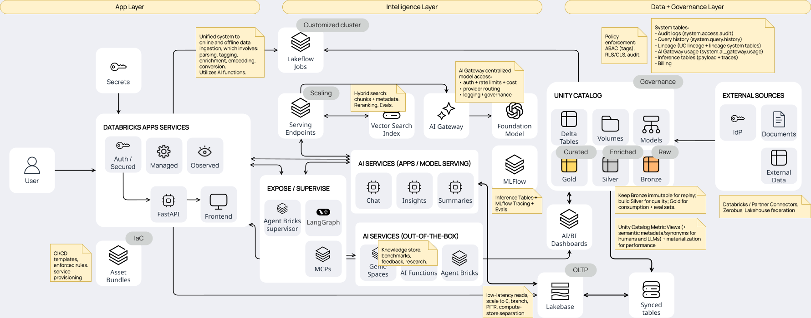
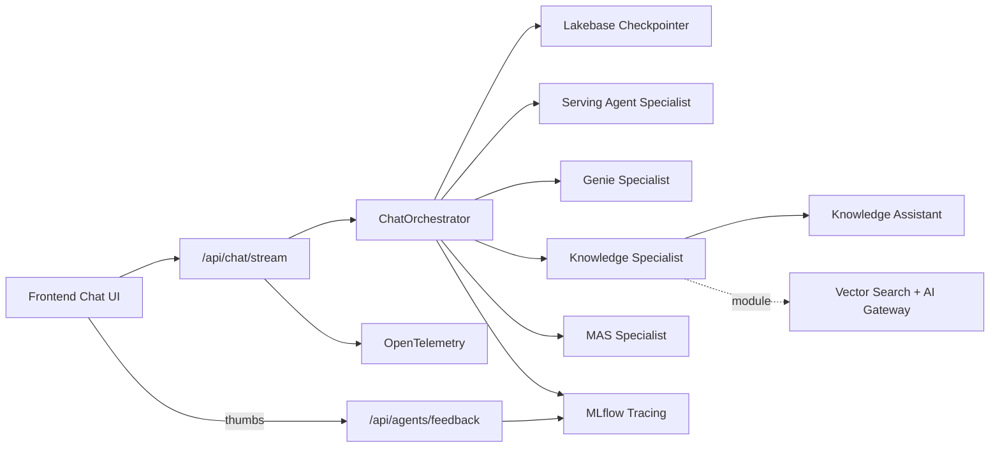

# databricks-apps-fastapi-starter

[](https://docs.databricks.com/en/dev-tools/databricks-apps/)
[](https://snyk.io/test/github/Paldom/databricks-apps-fastapi-starter)
[](https://sonarcloud.io/summary/new_code?id=Paldom_databricks-apps-fastapi-starter)
[](LICENSE)

A production-shaped **FastAPI + React starter for Databricks Apps** that is
agentic at every level — app, job, and serving endpoint — on one MLflow
`ResponsesAgent` contract. Chat runs through a LangGraph supervisor with
pluggable specialist agents; state lives in Lakebase; documents flow through a
RAG ingestion job into Vector Search; every call is MLflow-traced and scored by
an evaluation job. Deployment is exclusively Databricks Asset Bundles.

Deep-dive guides live in the [`docs/`](docs/README.md) wiki; the design
contract (golden path, module mechanism, intentional dualities) in
[`DESIGN.md`](DESIGN.md).

## Table of contents

- [The golden path](#the-golden-path)
- [Architecture](#architecture)
- [Capability matrix](#capability-matrix)
- [Prerequisites](#prerequisites)
- [Local development](#local-development)
- [Deployment](#deployment)
- [Chat architecture](#chat-architecture)
- [Observability](#observability)
- [Security](#security)
- [Health and readiness](#health-and-readiness)
- [Testing and quality gates](#testing-and-quality-gates)
- [CI/CD](#cicd)
- [Configuration](#configuration)
- [Troubleshooting](#troubleshooting)

## The golden path

Everything in the core exists to tell one story end to end:

```
 upload a document ──▶ file-arrival Job ingests it (Auto Loader → chunks → Vector Search)
        │                     └──▶ batch agent summarizes new docs (ai_query)
        ▼
 App chat (LangGraph supervisor) answers with the knowledge tool
        │                                        │
        ▼                                        ▼
 the same agent contract runs on a         every call lands in
 Model Serving endpoint (ResponsesAgent)   MLflow Tracing
        │                                        │
        ▼                                        ▼
 an evaluation Job scores the traces ◀── user feedback posts back
```

Anything beyond this path is an **optional module** (see
[docs/modules.md](docs/modules.md)) or a [`docs/`](docs/README.md) guide.

## Architecture

[](databricks-apps-architecture.svg)

**Thin app, heavy platform.** The app is a stateless UI/API layer: state goes
to Lakebase, heavy compute to Jobs/Serving/SQL, governance to Unity Catalog.
Every Databricks resource is bound in `resources/*.yml` and injected as env
vars (`value_from`) — no hardcoded IDs anywhere.

### Bundle-first deployment

This repository uses **Databricks Asset Bundles** as the single deployment
contract. All infrastructure is defined in modular YAML under `resources/` and
deployed with `databricks bundle deploy`. There is no workspace Repo sync, no
Git credential registration, and no manual `databricks apps deploy` step.

- **Runtime app config** (command, env vars) is one parametrized `app_config`
  complex variable shared by all targets — per-target differences come only
  from scalar variables (`environment`, `log_level`, `enable_obo`, …).
- **Resource-backed env vars** (`SERVING_ENDPOINT_NAME`, `JOB_ID`,
  `VOLUME_ROOT`, `MLFLOW_EXPERIMENT_ID`) are injected via `value_from`
  bindings; the Apps runtime injects `PG*` automatically from the database
  binding.
- **Three targets**: `dev`, `staging`, `prod` (see
  [Bundle targets](#bundle-targets)).

### Bundle resources

| Resource | File | Purpose |
|----------|------|---------|
| FastAPI App | `resources/app.yml` | App definition, resource bindings, runtime config |
| RAG ingestion + batch-agent job | `resources/compute.yml` | File-arrival ingestion, `ai_query()` summarization task |
| Serving agent deploy | `resources/serving_agent.yml` | Job + experiment deploying the `ResponsesAgent` endpoint |
| Lakebase instance | `resources/database.yml` | Postgres OLTP database (+ optional UC catalog registration) |
| MLflow experiments | `resources/experiment.yml` | App tracing + eval experiments |
| Agent evaluation job | `resources/evals.yml` | Scheduled `mlflow.genai.evaluate` runs |
| Vector Search | `resources/modules/knowledge-diy.yml` | Endpoint + Delta Sync index (module) |
| Cost guardrail | `resources/modules/cost-guardrail.yml` | Scheduled app stop/start (module, ships off) |

Optional modules are toggled by include-lines in `databricks.yml` — see
[docs/modules.md](docs/modules.md).

### App resource bindings

The app is granted least-privilege access to specific resources:

| Binding | Resource type | Permission |
|---------|---------------|------------|
| `serving-endpoint` | Serving endpoint (chat FM) | `CAN_QUERY` |
| `app-job` | Job (RAG ingestion) | `CAN_MANAGE_RUN` |
| `uc-volume` | UC Volume (uploads) | `WRITE_VOLUME` |
| `lakebase-db` | Database (Lakebase) | `CAN_CONNECT_AND_CREATE` |
| `experiment` | MLflow experiment | `CAN_MANAGE` |

Commented examples for `sql_warehouse`, `genie_space`, and `secret` bindings
sit in `resources/app.yml`; rules and gotchas in
[docs/app-resources.md](docs/app-resources.md).

### Repository layout

```
backend/                 # Self-contained Python project (uv, pyproject.toml)
  app/
    api/                 # Frontend-facing API routes (mounted at /api)
    chat/                # Chat orchestrator, memory, registry, tools, title
    agents/              # Unified agent adapters (app, serving, genie)
    modules/             # Optional-capability modules (+ _template scaffold)
    services/            # Business logic
    repositories/        # SQLAlchemy persistence (flush only)
    core/databricks/     # Databricks SDK adapters (serving, jobs, vector search, …)
    core/db/             # Async SQLAlchemy engine, session, URL builder
    middlewares/         # Auth, OBO, security headers, request size
    models/              # ORM models and DTOs
  alembic/               # Database migrations (auto-run on start)
  tests/                 # Backend tests (pytest)
frontend/                # React + TypeScript + Vite (assistant-ui chat)
notebooks/
  serving/               # Tool-calling ResponsesAgent + deploy job
  lifecycle/             # Author → trace → evaluate → prompt registry
  evals/                 # Agent evaluation job
  jobs/                  # RAG ingestion, batch summarization, app scheduler
resources/               # Bundle resource YAML (+ resources/modules/)
docs/                    # Deep-dive documentation wiki
scripts/                 # bootstrap-workspace, grant-db-access, OpenAPI export
databricks.yml           # Bundle config (dev / staging / prod targets)
DESIGN.md                # Design contract
Makefile                 # Developer convenience layer (run `make help`)
```

### Agent hosting: Apps vs Serving vs Jobs

Databricks offers three compute layers for hosting GenAI agents; this starter
uses all three deliberately:

| | Model Serving | Lakeflow Jobs | Databricks Apps |
|---|---|---|---|
| **Best for** | Synchronous inference, evals | Long-lived pipelines, batch | Interactive agents, APIs |
| **Latency** | Low (serverless) | Higher (spin-up) | Low (always-on) |
| **Timeout** | 297 seconds | None (configurable) | None |
| **Scaling** | Auto (serverless) | Per-job | Horizontal |
| **Access control** | Endpoint permissions | Job permissions | Built-in user auth |
| **Monitoring** | AI Gateway, inference tables | Job metrics, logs | OTel, MLflow, AI Gateway |
| **Deployment** | MLflow model registration | Bundle | Bundle |

- **Databricks Apps** hosts the main orchestrator (this app's supervisor).
- **Model Serving** hosts the tool-calling `ResponsesAgent`
  (`notebooks/serving/agent.py`) for governed, evaluable inference.
- **Lakeflow Jobs** run background agentics: ingestion, `ai_query()` batch
  summarization, scheduled evaluations.

## Capability matrix

*Core* is always deployed; *modules* activate from configuration and are
deletable in one commit ([docs/modules.md](docs/modules.md)). Check
`GET /api/capabilities` on a running app for live state.

| Capability | Where | Activation | Showcases |
|---|---|---|---|
| Chat with LangGraph supervisor + streaming NDJSON | core | always | Apps + FMAPI + LangGraph |
| Lakebase CRUD, Alembic auto-migrations, OAuth-token DB auth | core | always | Lakebase `database` binding |
| Durable chat memory (LangGraph checkpointer on Lakebase) | core | deployed default | Lakebase for agent state |
| Document upload → RAG ingestion job (file-arrival trigger) | core | always | Jobs, Auto Loader, UC Volumes |
| Batch agent in a job: `ai_query()` summarization | core job task | always (post-ingest) | job-level agentics, AI Functions |
| `ResponsesAgent` on Model Serving (tool-calling, streaming) | core (`notebooks/serving`) | `deploy_serving_agent` job | MLflow ResponsesAgent, UC models, `agents.deploy` |
| Agent evaluation job (MLflow GenAI evaluate) | core (`notebooks/evals`) | `agent_eval_job` | MLflow evals against deployed surfaces |
| Agent lifecycle notebooks (author → trace → evaluate → prompt registry) | `notebooks/lifecycle/` | run in workspace | MLflow 3 GenAI lifecycle |
| Human feedback → MLflow traces (`POST /api/agents/feedback`) | core | always | MLflow assessments, eval loop |
| MLflow Tracing (session/user context, downstream trace ids) | core | always | MLflow 3 tracing |
| Knowledge Assistant specialist (managed RAG) | core specialist | `KNOWLEDGE_ASSISTANT_ENDPOINT` | Agent Bricks KA |
| DIY RAG specialist (embed + Vector Search) | module `knowledge-diy` | embedding + VS settings | AI Gateway, Vector Search — duality with KA |
| Genie specialist (SDK) | core specialist | `GENIE_SPACE_ID` | Genie Conversation API |
| Remote app / serving agent specialists | core specialists | `APP_AGENT_NAME` / `SERVING_AGENT_ENDPOINT` | agent-to-agent calls |
| Multi-Agent Supervisor specialist (Agent Bricks MAS) | module `supervisor-agent` | `MAS_ENDPOINT` | agent orchestration delegation |
| Examples playground (Serving, Jobs, Genie REST, Volumes, SQL) | module `examples` | `ENABLE_DATABRICKS_INTEGRATIONS` | one platform call per endpoint |
| SQL Warehouse query via statement API (`/examples/sql`) | module `examples` | `DATABRICKS_WAREHOUSE_ID` + binding | `sql_warehouse` binding, governed SQL |
| Scheduled app stop/start (cost guardrail) | module `cost-guardrail` | include-list toggle (ships off) | Apps lifecycle API, job schedules |
| On-behalf-of (OBO) user authorization | core | `ENABLE_OBO` (prod target) | Apps user auth |

## Prerequisites

- Python 3.11+ and [uv](https://docs.astral.sh/uv/)
- Node 22+ (frontend)
- [Databricks CLI](https://docs.databricks.com/en/dev-tools/cli/install.html) ≥ 0.283.0
- Optional: the [Databricks AI Dev Kit](https://github.com/databricks-solutions/ai-dev-kit)
  MCP server for AI-assisted development (`.mcp.json` has the `databricks` entry)
- A workspace with **Databricks Apps**, **Lakebase (OLTP)**, and
  **serverless jobs** available (all bundle jobs run serverless), plus the
  **User authorization for Databricks Apps** preview for OBO

## Local development

The local workflow is **API on the host + Postgres in Docker**; Databricks
integrations are optional and disabled by default.

```bash
git clone https://github.com/Paldom/databricks-apps-fastapi-starter.git
cd databricks-apps-fastapi-starter

cp backend/env.example backend/.env
make install-backend      # uv sync
make dev-db               # Docker Postgres
make migrate-up           # alembic upgrade head
make dev                  # API :8000 + frontend :5173 (or dev-api for API only)
```

With the defaults from `backend/env.example`, these work without Databricks
credentials:

- `http://localhost:8000/api/docs` — interactive API docs
- `http://localhost:8000/api/health/live` — liveness
- `http://localhost:8000/api/me` — current user (dev fallback identity)
- `http://localhost:8000/api/capabilities` — module/specialist state
- the chat UI against MSW mocks (`VITE_ENABLE_MOCKS`)

### Remote-integrated local mode

To exercise real Databricks-backed routes locally set
`ENABLE_DATABRICKS_INTEGRATIONS=true`, `DATABRICKS_HOST`, and either
`DATABRICKS_TOKEN` or `DATABRICKS_CLIENT_ID`+`DATABRICKS_CLIENT_SECRET`, plus
any route-specific config (`SERVING_ENDPOINT_NAME`, `GENIE_SPACE_ID`, …).
You can also use `databricks apps run-local --prepare-environment --debug`.
In offline mode, Databricks routes return clear `503`s instead of breaking
startup.

## Deployment

### First deploy to a workspace

```bash
databricks auth login --host https://<workspace-url> --profile my-ws

make bootstrap-workspace PROFILE=my-ws   # detects a catalog, creates the
                                         # /Shared folder, builds the frontend,
                                         # probes a Responses-capable FM model,
                                         # writes BUNDLE_VAR_* overrides
source .bundle-vars.dev.sh
databricks bundle deploy -t dev -p my-ws
databricks bundle run  -t dev -p my-ws fastapi_app
```

The app creates its own schema and runs migrations on every start — the
`lakebase-db` binding grants `CAN_CONNECT_AND_CREATE`, so no manual database
step is normally needed. If startup logs still show
`permission denied for schema public` (details in
[docs/lakebase.md](docs/lakebase.md)), run the fallback once:

```bash
make grant-db-access PROFILE=my-ws
databricks bundle run -t dev -p my-ws fastapi_app   # restart to pick it up
```

Verify:

```bash
curl -H "Authorization: Bearer $(databricks auth token -p my-ws -o json | jq -r .access_token)" \
  https://<app-url>/api/health/ready          # {"ok":true,"db":true}
```

Every first-deploy failure mode we hit while building this starter is
catalogued with its fix in [docs/deployment.md](docs/deployment.md).

### Deploy commands

```bash
databricks bundle validate -t dev|staging|prod
databricks bundle deploy   -t dev|staging|prod
databricks bundle run      -t dev fastapi_app
databricks bundle run      -t dev deploy_serving_agent   # ResponsesAgent endpoint
databricks bundle run      -t dev agent_eval_job         # evaluation run
databricks bundle summary  -t dev                        # view deployed resources
```

Makefile mirrors: `make bundle-validate|bundle-deploy|bundle-run|bundle-summary`
with `TARGET=` (default `dev`).

### CI/CD service principal (one time)

For GitHub Actions deploys create a service principal
(`databricks service-principals create --display-name fastapi-starter-deployer`)
and either configure [GitHub OIDC federation](docs/oidc-deploy.md)
(recommended, no long-lived secrets) or store a client secret. Required
workflow secrets: `DATABRICKS_HOST`, `DATABRICKS_CLIENT_ID`,
`DATABRICKS_CLIENT_SECRET` (omit with OIDC).

### Bundle targets

| Target | Mode | App name | Docs enabled | OBO | Log level |
|--------|------|----------|--------------|-----|-----------|
| `dev` | development | `fastapi-starter` | yes | no | DEBUG |
| `staging` | default | `fastapi-starter-stg` | no | no | INFO |
| `prod` | default | `fastapi-starter-prod` | no | yes | INFO |

Dev mode prefixes bundle-declared schemas/resources with `dev_<user>_` — the
bootstrap script accounts for this in the generated variable overrides.

## Chat architecture

A LangGraph-based orchestrator streams NDJSON events from the FastAPI backend.


```mermaid
flowchart LR
    UI[Frontend Chat UI] --> API["/api/chat/stream"]
    API --> ORCH[ChatOrchestrator]

    ORCH --> MEM[Lakebase Checkpointer]
    ORCH --> SERVE[Serving Agent Specialist]
    ORCH --> GENIE[Genie Specialist]
    ORCH --> KNOW[Knowledge Specialist]
    ORCH --> MAS[MAS Specialist]

    KNOW --> KA[Knowledge Assistant]
    KNOW -. module .-> VS[Vector Search + AI Gateway]

    ORCH --> MLFLOW[MLflow Tracing]
    API --> OTEL[OpenTelemetry]
    UI -- thumbs --> FB["/api/agents/feedback"] --> MLFLOW
```

### LangGraph supervisor

The supervisor routes to specialist tools; only specialists whose backing
resources are configured get registered (the same mechanism powers optional
modules — `GET /api/capabilities` shows live state):

1. **App specialist** — a remote Databricks App via the Responses API
   (`APP_AGENT_NAME`).
2. **Serving agent specialist** — the deployed `ResponsesAgent` endpoint
   (`SERVING_AGENT_ENDPOINT`).
3. **Genie specialist** — structured analytics via the Genie Conversation API
   (`GENIE_SPACE_ID`).
4. **Knowledge specialist** — managed RAG via an Agent Bricks Knowledge
   Assistant (`KNOWLEDGE_ASSISTANT_ENDPOINT`); the DIY embed+Vector-Search
   path is the `knowledge-diy` module (a deliberate duality — see DESIGN.md).
5. **Multi-Agent Supervisor specialist** — delegation to an Agent Bricks MAS
   (`MAS_ENDPOINT`, `supervisor-agent` module).

All specialists delegate to unified adapters (`app/agents/adapters/`)
implementing one `AgentAdapter` contract that returns MLflow Responses-shaped
results — the same adapters power `POST /api/agents/{backend}/invocations`
for evals and debugging.

### Conversation memory

Server-side memory is keyed by `thread_id` (chat session ID). First request
seeds full history; later requests append only the newest user message.

| Backend | Setting value | Notes |
|---------|--------------|-------|
| Lakebase | `lakebase` | **Deployed default.** LangGraph `AsyncPostgresSaver` in the app's schema; per-connection OAuth token refresh; survives restarts. Falls back to in-memory with a warning if the DB is unreachable. |
| In-memory | `inmemory` | Local-dev default. State is lost on restart. |

Set `LANGGRAPH_MEMORY_BACKEND` to choose; details in
[docs/lakebase.md](docs/lakebase.md).

### Streaming event contract

The orchestrator emits NDJSON events consumed by the frontend adapter
(`frontend/src/lib/assistant`): `text-delta`, `tool-call-begin`,
`tool-call-delta`, `done` (carries `thread_id` + `trace_id`), `error`.

### Title generation

After the first successful stream, best-effort async title generation runs
(3–6 words, write-once-if-empty — never overwrites, even under concurrency).
Disable with `ENABLE_CHAT_TITLE_GENERATION=false`.

### Feedback loop

The `done` event carries the MLflow trace id; the UI (or any client) posts
`POST /api/agents/feedback {trace_id, value, rationale}` and the assessment is
attached to the trace as a HUMAN source — feeding evaluation and monitoring.

## Observability

Dual-track by design (an intentional duality, not redundancy):

| Signal | System | What it captures |
|--------|--------|------------------|
| App/infra traces | **OpenTelemetry** | HTTP spans (FastAPI, httpx), SQL spans (SQLAlchemy), manual spans around Serving/Jobs/Vector Search/Genie calls |
| GenAI traces | **MLflow** | LangGraph + OpenAI autologging, per-request session/user metadata, downstream trace ids from specialist calls |
| Endpoint usage | **AI Gateway** | Configured endpoint-side; lands in `system.ai_gateway.usage` |
| Request/response logs | **Inference tables** | Endpoint-side UC Delta logging |
| Log correlation | logging config | every line carries `otelTraceID`, `otelSpanID`, `request_id` |

MLflow tracing bootstraps at startup when `MLFLOW_EXPERIMENT_ID` is set (the
bundle injects it from the experiment resource). Per-request metadata is
attached via `mlflow.update_current_trace()`.

The app runs under `opentelemetry-instrument`, but OTLP exporters ship
**disabled** (`OTEL_*_EXPORTER: none`) because no collector runs inside the
Apps container. To use the OTel-native Apps telemetry beta (spans/logs to UC
tables) or a local Jaeger, see
[docs/otel-native-apps.md](docs/otel-native-apps.md).

## Security

### Authentication

Databricks Apps authenticates users and forwards identity via headers:

| Header | Maps to |
|--------|---------|
| `X-Forwarded-User` | `user.id` (primary key) |
| `X-Forwarded-Email` | `user.email` |
| `X-Forwarded-Preferred-Username` | `user.preferred_username` |

Locally, either keep `ENABLE_LOCAL_DEV_AUTH_FALLBACK=true` (fallback identity
from `LOCAL_DEV_USER_ID`) or pass the headers manually:

```bash
curl http://localhost:8000/api/projects -H "X-Forwarded-User: me@example.com"
```

With `ENABLE_OBO=true` (prod target), a per-request `WorkspaceClient` is
built from the user's forwarded token for user-scoped operations.

### Request limits & headers

| Content type | Default limit | Setting |
|--------------|---------------|---------|
| JSON / other | 1 MiB | `MAX_REQUEST_BODY_BYTES` |
| Multipart uploads | 50 MiB | `MAX_UPLOAD_BYTES` |

Enforced centrally by `RequestSizeMiddleware`. OWASP-recommended headers
(HSTS, content-type, frame, referrer policies) are applied via the
[`secure`](https://github.com/TypeError/secure) library.

## Health and readiness

- `GET /api/health/live` — process liveness
- `GET /api/health/ready` — core readiness (database required; `db:true`
  proves Lakebase connectivity)
- `GET /api/health` — detailed health incl. Databricks integration status
- `GET /api/capabilities` — active modules and specialists

Databricks-dependent routes fail at request time with clear `503`s when
unconfigured; inactive module routes are absent (`404`).

## Testing and quality gates

```bash
# The backend quality gate (~10s) — run before calling backend work done
cd backend
uv run ruff check . && uv run ruff format --check . && uv run mypy . && uv run pytest --cov

make test lint typecheck security    # repo-wide mirrors
```

- mypy is **strict** with a shrink-only `ignore_errors` ratchet in
  `pyproject.toml`; suppressions must be error-code-scoped.
- pytest enforces a proven branch-coverage floor; Hypothesis property tests
  cover the pure helpers; `filterwarnings=error`.
- The serving agent has an offline smoke test:
  `uv run python ../notebooks/serving/test_agent_smoke.py`.
- Frontend: Vitest (80% coverage), Stryker mutation testing, Storybook,
  ESLint layering rules, orval-generated client with a CI freshness check.

### Performance testing

```bash
make load-test        # Locust, 50 users, 60s, HTML report
```

Set `HOST` (+ SP credentials) to target a remote deployment. Tips — mock the
LLM to isolate infra throughput, track time-to-first-token — in
[docs/load-testing.md](docs/load-testing.md).

### Database migrations

Alembic is the sole schema authority and **runs automatically** on every
deploy/restart (`run_app.py` → `alembic upgrade head`) using the same engine
and OAuth hook as the app, in the app's own schema (`starter`).

```bash
make migrate-up                                   # local
make migrate-new MIGRATION_MESSAGE="my change"    # new revision
```

### Contract generation

```bash
make generate    # OpenAPI spec + frontend client (orval) + requirements.txt
```

CI fails on stale generated files — never hand-edit
`frontend/src/shared/api/generated/`.

## CI/CD

| Workflow | Trigger | What it does | Needs |
|----------|---------|--------------|-------|
| `ci.yml` | PR, push, merge queue | ruff, mypy, bandit, pytest+coverage, frontend build/lint/test, contract drift, bundle validate → `all-checks-passed` aggregator | nothing |
| `pre-commit.yml` | PR, push | hygiene/format/schema hooks mirror | nothing |
| `codeql.yml` / `gitleaks.yml` | PR, push, weekly | code scanning / secret scanning | nothing |
| `snyk-security.yml` | PR, push, weekly | dependency + SAST scanning | `SNYK_TOKEN` (skips if absent) |
| `sonar.yml` | PR, push | SonarCloud quality gate | `SONAR_TOKEN` (skips if absent) |
| `deploy.yml` | push to main, manual | `bundle validate/deploy/run` | SP secrets or [OIDC](docs/oidc-deploy.md) |
| `release.yml` | version tags | gated GitHub Release with provenance-attested artifacts | nothing |
| `ci-load-test.yml` | PR, manual | Locust smoke run | nothing |

Branch protection requires only the `all-checks-passed` aggregator. All
actions are SHA-pinned; workflows pass `zizmor` static analysis.

## Configuration

All settings are read **only** in `backend/app/core/config.py` (pydantic
Settings; env binding by field name). Locally use `backend/.env`; deployed,
resource-backed values arrive via `value_from` bindings. Highlights:

| Variable | Description | Deployed source |
|----------|-------------|-----------------|
| `SERVING_ENDPOINT_NAME` | Chat FM endpoint | `value_from: serving-endpoint` |
| `JOB_ID` | RAG ingestion job | `value_from: app-job` |
| `VOLUME_ROOT` | UC volume path | `value_from: uc-volume` |
| `PGHOST/PGDATABASE/PGUSER` | Lakebase connection | auto-injected by the database binding |
| `MLFLOW_EXPERIMENT_ID` | Tracing experiment | `value_from: experiment` |
| `LANGGRAPH_MEMORY_BACKEND` | `lakebase` / `inmemory` | bundle variable (deployed default `lakebase`) |
| `PG_APP_SCHEMA` | App-owned Postgres schema | default `starter` |
| `SUPERVISOR_MODEL`, `TITLE_MODEL` | Optional model overrides | add env entry when set |
| `KNOWLEDGE_ASSISTANT_ENDPOINT`, `GENIE_SPACE_ID`, `APP_AGENT_NAME`, `SERVING_AGENT_ENDPOINT`, `MAS_ENDPOINT` | Optional specialists | add env entry when set |
| `AI_GATEWAY_EMBEDDING_MODEL`, `VECTOR_SEARCH_*` | knowledge-diy module | add env entries when set |
| `DATABRICKS_WAREHOUSE_ID` | examples SQL endpoint | `sql_warehouse` binding |

Optional settings get an env entry **only when configured** — bundles prune
empty values and the Apps API rejects valueless entries
([docs/app-resources.md](docs/app-resources.md)). Full list:
`backend/env.example`.

## Troubleshooting

The three most common issues (full table in
[docs/deployment.md](docs/deployment.md)):

- **App returns 502** — the app must bind `0.0.0.0` on `DATABRICKS_APP_PORT`;
  `backend/run_app.py` handles this. Check `/logz` in the Apps UI for import
  errors.
- **`permission denied for schema public`** (migrations/checkpointer) — run
  `make grant-db-access` once after the first deploy.
- **Bundle validation fails** — `databricks bundle validate -t dev`; usual
  causes are stale resource references or YAML errors in complex variables.

## License

MIT — see [LICENSE](LICENSE).
